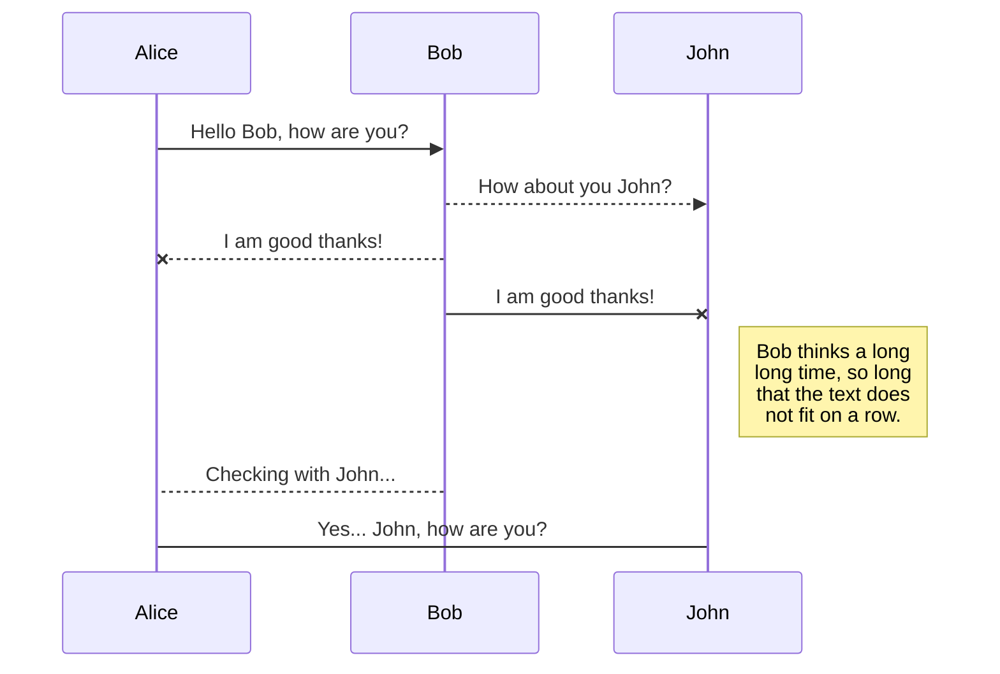

___
# h1 見出し
## h2 見出し
### h3 見出し

## 強調
**太字サンプルテキスト**
*斜体サンプルテキスト*
~~打ち消しサンプルテキスト~~

## 引用
> 引用テキスト
>> 引用テキスト
> > > 引用テキスト

## リスト
+ リストテキストサンプル
+ リストテキストサンプル
  - リストテキストサンプル
    * リストテキストサンプル
    + リストテキストサンプル
    - リストテキストサンプル
+ リストテキストサンプル

番号付きリスト

1. 番号付きリストテキストサンプル
2. 番号付きリストテキストサンプル
3. 番号付きリストテキストサンプル

## コード
```
console.log("Sample text")
```

シンタックスハイライト

``` js
var foo = function (bar) {
  return bar++;
};

console.log(foo(5));
```

Mermaid



## テーブル

| 項目 　 | 説明　　　　  |
| ------ | ----------- |
| 項目①  | テキストテキストテキストテキストテキストテキスト |
| 項目②  | テキストテキストテキストテキストテキストテキスト |
| 項目③  | テキストテキストテキストテキストテキストテキスト |

## リンク

[テキストリンク](https://www.google.com/)

### 脚注

脚注 1 リンク[^first].

脚注 2 リンク[^second].

[^first]: 脚注1説明

[^second]: 脚注2説明